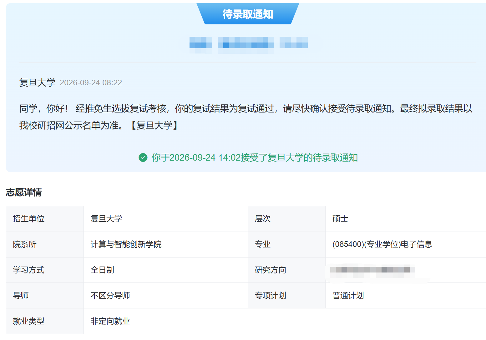
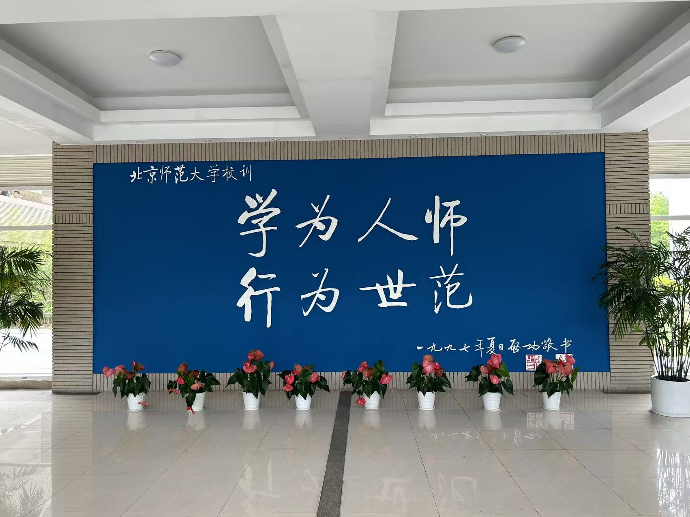
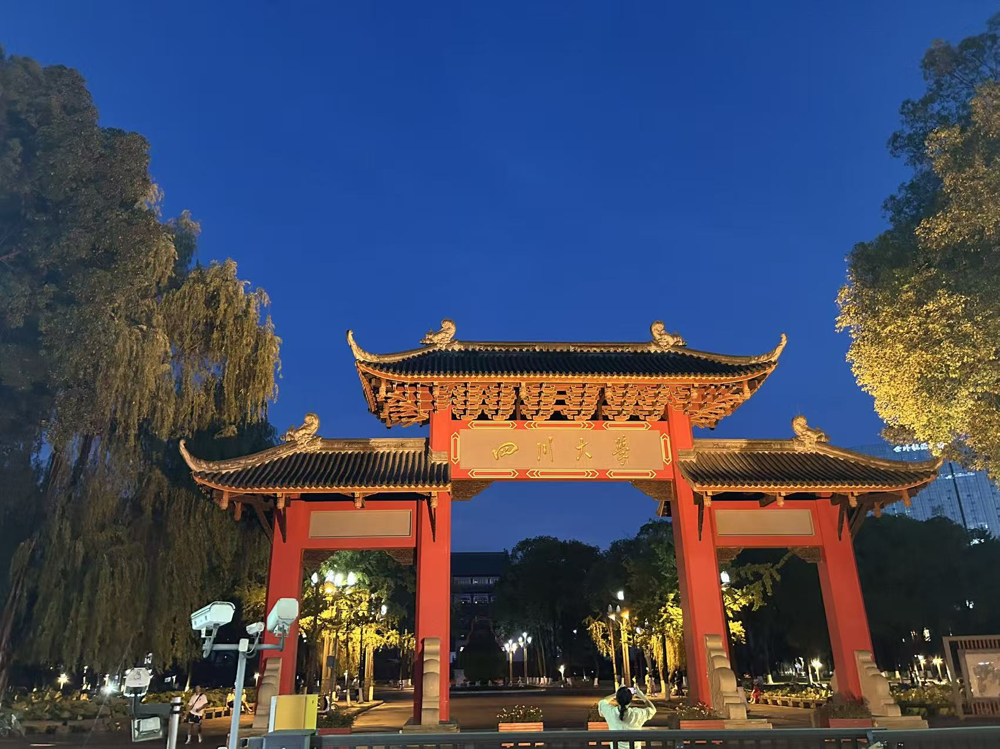
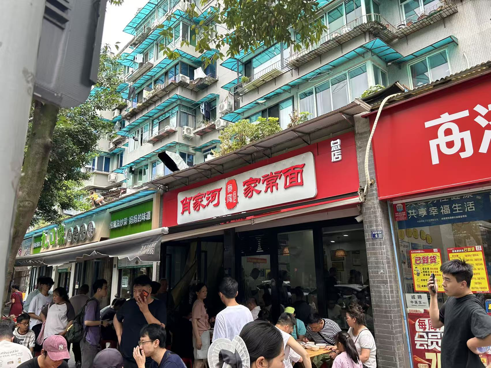
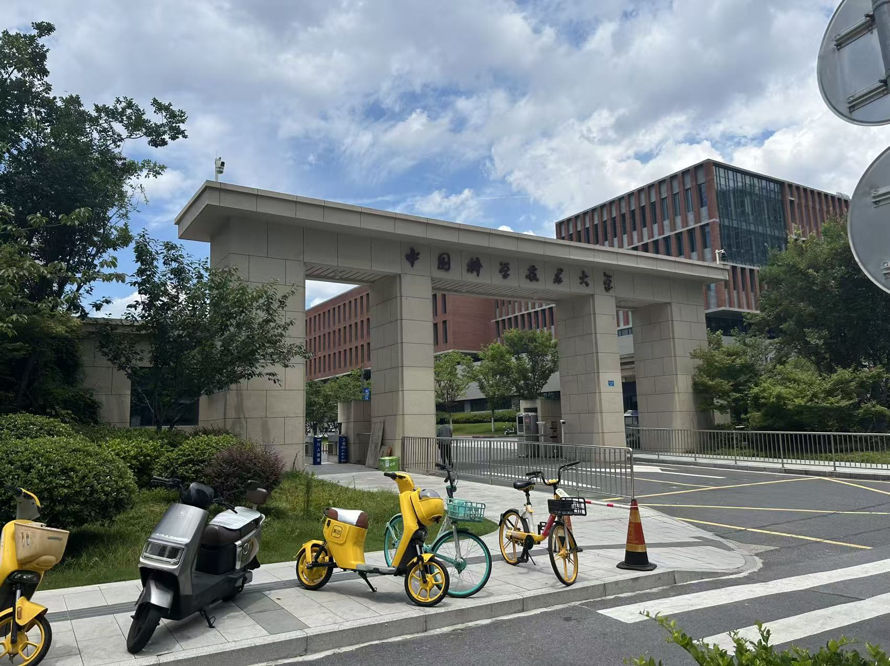
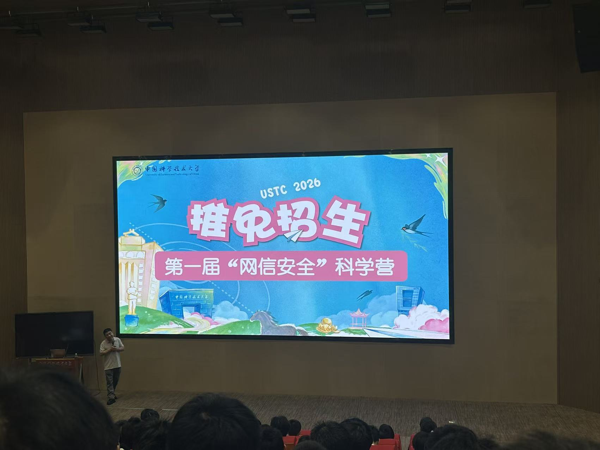
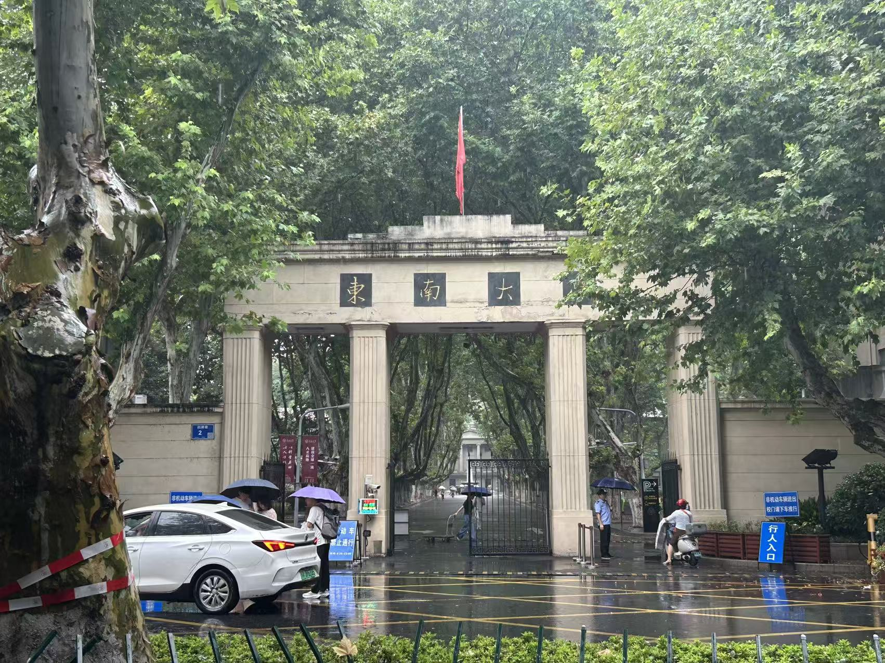
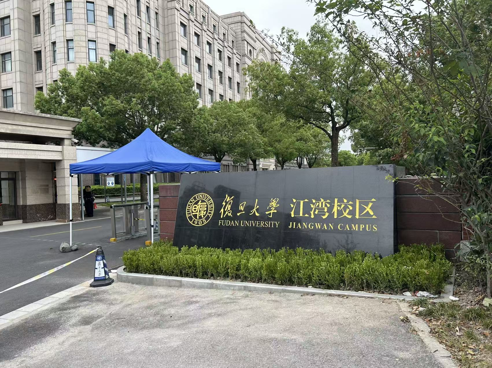
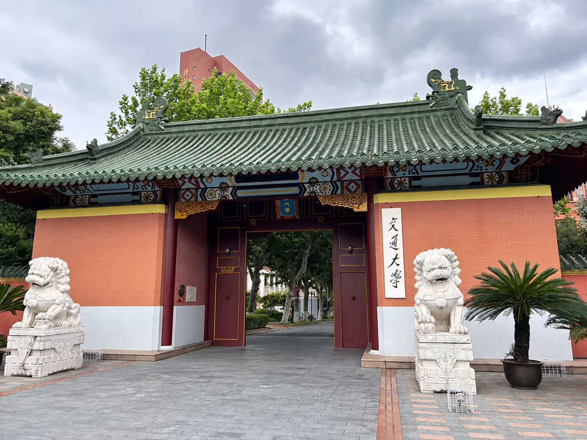

# 保研经验贴

> **内容性质：** 年级课程导读与个人经验
>
> **适用范围：** 暨南大学计算机科学与技术专业学生。
>
> **最后核验：** 2026-10-08
>
> **作者：** [MayL](https://github.com/sekirooox)

## 背景
- **院校专业**：211 计算机科学与技术
- **排名**：2/36，前5.55%
- **英语**：六级 600+
- **竞赛**：数模省二，美赛F奖，统计建模省二，蓝桥杯省三，APMCM亚太杯国一等水赛...，**毫无含金量可言**。
- **科研**：CCF-B类会议一作 (已见刊，CV方向)，CCF-A类期刊在投共一第二 (被拒重投，垃圾方向)，CCF-A类期刊在投共一第二 (被拒，可信AI方向)，CCF-C类会议三作 (已见刊，垃圾方向)。看似很多，实际上**全是垃圾方向和垃圾会议**，因此在保研过程中，根本不敢碰瓷别的学校的强组 (**被无数个老师嫌弃过科研方向**)，于是后来就决定锚定放养类型的导师了。
- **最终去向**：FDU 计算与智能创新学院 电子信息专硕
- **偏好**：目标就业，学硕>=专硕>>>直博。导师人品=是否放实习>研究方向。

<figure><figcaption>
最终去向：复旦大学 计算与智能创新学院 电子信息专硕
</figcaption></figure>

## 扫盲
bg：个人背景，包括本科学校、竞赛、英语、科研等。

rank：指你的排名，专业排名、学院排名、综测排名（1%，3%，5%），当然也有具体排名rk1（第一名）。报名时，你可以选择校务能开具的最好看的成绩，当然一些学校会明确要求你使用成绩排名（如浙江大学）。

bar：入围某所学校夏令营或者预推免的门槛

title：学校的层次。top2/tp（清北）、华五（浙大、复旦、上交、南大、中科大）、C9（特指西交和哈工大），下面为计算机圈子广为流传的一张图：

强/弱com：communittee，强com意味着筛选由学院完成，导师的话语权不足，无法捞你；相反，弱com，老师可以决定你的去留，你得到了老师的认可，可以直接录取。

## 夏令营

今年形式很不好，**大部分夏令营毫无效力**，浪费了本人很多精力和金钱来参加，**下面只列举了一些本人线下参加过的夏令营**。

| 学校 | 院系 | 专业名称 | 强弱com | 是否入营 | 是否有效力 | 备注 |
| --- | --- | --- | --- | --- | --- | --- |
| 中科大 | 网络空间安全学院 | 085412网络空间安全 | 强 | 是 | **是** | 补录 |
| 北京师范大学 | 文理学院 | 085404计算机技术 | 强 | 是 | 否 | |
| | 人工智能学院 | 085410人工智能 | 未知 | 否 | 否 | |
| 上海科技大学 | 信息科学与技术学院 | 085404计算机技术 | 未知 | 否 | 否 | |
| 中国科学院大学 | 杭州高等研究院 | 085404计算机技术 | 未知 | 否 | **是** | |
| | 计算机网络信息中心 | 085404计算机技术 | 未知 | 否 | 否 | |
| | 深圳先进技术研究所 | 085404计算机技术 | 未知 | 否 | 否 | |
| | 软件所 | 085404计算机技术 | 未知 | 否 | 否 | |
| | 自动化所 | 085404计算机技术 | 未知 | 否 | 否 | |
| 中山大学 | 计算机学院 | 085404计算机技术 | 强 | 是 | 否 | |
| 山东大学 | 网络空间安全 | 085412网络空间安全 | 强 | 是 | 否 | |
| | 软件学院 | 085405软件工程 | 强 | 是 | 否 | |
| | 计算机学院 | 085404计算机技术 | 强 | 是 | 否 | |
| | 人工智能学院 | 085410人工智能 | 强 | 是 | 否 | |
| 四川大学 | 计算机学院 | 085404计算机技术 | 强 | 否 | 否 | |
| | 人工智能 | 085410人工智能 | 强 | 是 | 否 | |
| 同济大学 | 国家卓越工程师 | 085404计算机技术 | 未知 | 否 | 否 | |
| 华东师范大学 | 软件学院 | 085405软件工程 | 未知 | 否 | 否 | |
| | 大数据学院 | 085405大数据工程与技术 | 未知 | 否 | 否 | |
| 同济大学 | 国家卓越工程师 | 085400电子信息 | 未知 | 否 | 否 | |
| 上海交通大学 | 生物医学工程 | 085409生物医学工程 | 未知 | 否 | 是 | |
| 浙江大学 | 海宁国际校区 | 085410人工智能 | 强 | 是 | 否 | |
| 天津大学 | 计算机科学与技术 | 085404计算机技术 | 强 | 否 | 否 | |
| | 软件 | 085405软件工程 | 强 | 否 | 否 | |
| | 网安 | 085412网络空间安全 | 强 | 否 | 否 | |
| 电子科技大学 | 计算机科学与技术 | 085404计算机技术 | 强 | 否 | **是** | |
### 北师珠 文理学院
我参加的第一个夏令营，基本就是酒店躺了两天。

中间有一个面试环节，~~不过老师好像不怎么在意~~，**只能说是体验了一下院校面试**！

<figure><figcaption>
学为人师，行为世范
</figcaption></figure>

北师珠的安排还是比较抽象的，就是参加一下学院的活动。

>本身学校还是很大的，但是天公不作美，一直在下暴雨，淋淋沥沥的，就像这段保研时光。

### 四川大学 人工智能学院
本来我是报的是四川大学的计算机学院，但是我们各个专业的RK1貌似都报了该学院，于是顺利落选，最后被人工智能学院收留🤣。

<figure><figcaption>
四川大学的校门，学校还是很美的
</figcaption></figure>

没想到，**这是最为抽象的一个夏令营**。活动的流程就是课题组进行宣讲，硬控你一个上午和下午。甚至还有无法评价的**参观"毛胚房"环节** (人工智能学院的办公地点**尚在建设中**)，特别特别逆天。

四川大学的人文关怀也是比较抽象，~~让学生住的宿舍有点过分逆天了，阳台和房间竟然是一体的🫥~~！**在室内晾晒衣服都来了**！

而且住宿**毫无配套**，基本就是凉席上裸睡，严重怀疑是请我们来吸尘的😤！

本来还是比较想来四川读研究生的，结果被狠狠劝退了。~~实际我就是想顺便来四川旅游。~~

<figure><figcaption>
康神开播了，真的假的？卧槽，真开播了！
</figcaption></figure>

>~~不过还是交到了几个朋友~~，我的一个舍友是某985 SE专业，最后也保研到NJU了，只能说和他交流了一下，他对科研的理解确实对我有启发作用。

### 中科大 网络空间安全学院
之前的学长无陶瓷入过中科大的网络空间安全学院，虽然本人更想去的是先进技术研究院和计算机学院，但是实在陶瓷不到老师啊😭。

3月后期我就开始疯狂轰炸USTC老师的邮箱，**回复率非常非常非常低**，基本上100封邮件，回复的只有几个。

一方面，陶瓷时间可能偏早。另一方面，由于我的科研方向都是垃圾方向，和主流的LLM和CV有一定差异，**基本上很难找到match的老师**，而中科大又是典型的弱com，不陶瓷几乎没有机会，所以客观上导致老师不太愿意接受不match的我😭。

于是，我最终**只能填报中科大的网安学院，这个是强com**，也是有效力的。

中科大网安学院的入营是强com，学院考核几乎全员通过，**但需要和老师口头签订契约，合成最终有效力的offer**。

中科大的夏令营分为三天：
#### 第零天：全季酒店报道和课题组私下面试。

至于为啥要单独划分一天，是因为这个时候很多老师就已经开始了面试。

我在中午报道后，第一时间就参加了Chu老师的课题组面试，说实话，压力还是有的，老师问的很详细，不过并没有为难学生。

此外，我还参加了Liu老师的私面，~~听说他是一个🐏导~~，所以也没有问出来什么东西，就是简单确认了意向，表表忠心后就结束了。

于是，我的第零天就以两场私面结尾了。

#### 第一天：学院方面的面试。

上午和下午都是**学院方面的面试**，大概有4-5个老师来面试你，需要3min的自我介绍+1min的英语自我介绍，没有英语问题环节，剩下10min都是答辩环节。

<figure><figcaption>
中科大高新校区的校门，真霸气！
</figcaption></figure>

>学院面几乎不会斩杀学生，部分老师甚至着急下班，随意提问几个无关痛痒的问题就匆匆结束🤣。

#### 第二天：开营仪式+课题组面试

上午是开营仪式，下午是课题组下午的面试。
<figure><figcaption>
中科大第一届的"网信安全"科学营的开营仪式
</figcaption></figure>

搞笑的是，**这个时候课题组的名额都爆满了，想获得offer简直是大海捞针**。

我在下午面试了Chen老师的课题组。但很遗憾，估计2-3个招生名额，来了30多个同学来面试，池子很大，且Chen老师的研究方向是偏电磁和无线 ~~(与网安的关系是?)~~，所以自然没有入选。

#### 小结
幸运的是，我在准备离开时接到了其中一位老师的电话offer，后续也签订了双选契约。

>不过经过综合考虑，我后面还是放弃了这个offer，给了有缘人！

USTC的夏令营给了我很多感动，也是第一次认识那么多优秀的同学。

据我所知，参加过USTC夏令营但最终没有来的同学，普遍的去向都是华5以上，**华五质检员**！

## 预推免
今年的预推免也很不友好，面试时间集中于8月末到9月中旬，这会导致在相当长的一段时间内，完全没有offer，**非常焦虑**😱！

| 专业名称 | 院系 | 强弱com | 专业 | 是否入营 | 是否优营 | 备注 |
| --- | --- | --- | --- | --- | --- | --- |
| 复旦大学 | 计算机学院 | 强 | 085400电子信息 | 是 | 通过 | 第一批，网络空间安全方向 |
| 中山大学 | 计算机学院 | 强 | 085404计算机技术 | 否 | | |
| | 网络空间安全学院 | 强+弱 | 085412网络空间安全 | 是 | 未参加 | |
| | 人工智能学院 | 弱 | 085410人工智能 | 是 | 未参加 | |
| | 智能工程学院 | 强 | 085410人工智能 | 否 | | |
| | 软件工程 | 强 | 085405软件工程 | 是 | 未参加 | 第二批 |
| 东南大学 | 计算机学院 | 强 | 085405软件工程 | 是 | 超高位排名 | |
| 同济大学 | 无人系统 | 强 | 140500智能科学与技术 | 否 | | |
| 中科院 | 软件研究所 | 强 | 085404计算机技术 | 否 | | |
| | 计算机网络信息 | 强 | 085404计算机技术 | 是 | 未参加 | |
| | 信息工程所 | 强 | 085404计算机技术 | 是 | 未参加 | |
| | 深圳技术 | 未知 | 085404计算机技术 | 否 | | |
| 华东师范 | 大数据学院 | 未知 | 085405大数据工程与技术 | 否 | | |
| | 软件学院 | 强+弱 | 085405软件工程 | 是 | 未参加 | |
| 天津大学 | 计算机学院 | 弱 | 085404计算机技术 | 否 | | |
| | 软件学院 | 弱 | 085405软件工程 | 否 | | |
| | 人工智能 | 弱 | 085410人工智能 | 否 | | |
| 上科大 | 计算机学院 | 强 | 085404计算机技术 | 是 | 未参加 | |
| 南京大学 | 软件学院 | 强+弱 | 085405软件工程 | 否 | | |
| | 智能软件学院 | 未知 | 085405软件工程 | 否 | | |
| 浙江大学 | 海宁国际学院 | 强 | 085410人工智能 | 是 | 未参加 |第一批 |
| 湖大 | 人工智能 | 强 | 085410人工智能 | 是 | 未参加 | 第一批 |
| 中南 | 计算机学院 | 强 | 085404计算机技术 | 是 | 未参加 | 第一批 |
| 大连理工大学 | 软件学院 | 未知 | 085405软件工程 | 否 | | |

### 东南大学 软件学院
#### 面试过程
东南大学软件学院只有面试，没有笔试和机试。

东南大学的推免今年有大的变迁，**取消了弱com推荐**，强com入营，高分六级和一作论文 (B会及以上级别)加分非常多，甚至大于rk1。

东南的面试控制在15min，3min自我介绍，2min英语问答。

实际上我介绍完自己后，就剩下1min多英语提问时间，英语面试老师就简单问了我一个有关于WLB的问题，然后我胡乱回答一番，就这么轻松糊弄过去了🫤。

剩下10min就是科研经历方面的拷打，不过显然没有老师认识我的垃圾方向，问得就是一些相对表面的问题，没有问你为什么要这么做之类的问题。

> 小插曲：东南大学的电脑设备非常垃圾，导致我播放我的PPT时，**图片竟然乱码了！根本无法正常显示**！我自我介绍到一半才发现到这个问题，尴尬的无地自容😵。

面试完我第一感觉就是凉凉了，**感觉与东南大学无缘了**。不过幸运的是，有一个面试老师**竟然认识我** (之前广撒网的结果)，甚至面试完当天VX打电话问我今天表现，**还说给我打了高分**。

~~给老师跪了给老师跪了给老师跪了~~。

<figure><figcaption>
东南大学的校门，个人而言最喜欢的一个校门
</figcaption></figure>

#### 面试结果
最后，在**神秘力量**的帮助下，我成功取得了超高位优营。

> ~~为什么最后没来东南大学~~？我有罪😬

### 复旦大学 计算与智能创新学院
说实话，本来想报名复旦大学的未来信息创新学院的。

结果发现**与其选择个偏门方向最后不来，不如直接冲个好一点的学院**，于是就填报了计算与智能创新学院。

不过我还是谨慎了，填报了网络安全的方向。从结果来看，应该大胆填报计算机学科的方向的。

<figure><figcaption>
复旦你的门就这样???
</figcaption></figure>

<figure><figcaption>
陪一张上交的校门🥰🥰🥰这是真好看啊！！！
</figcaption></figure>

#### 机试过程
> **机试难度一定要对齐算法竞赛**。
>

复旦的机试占总分的30%。

虽然我平时也有练习机试，也刷过了leetcode hot100，[ACWing算法基础课](https://www.acwing.com/activity/content/introduction/11/group_buy/230033/)和[代码随想录](https://programmercarl.com/)，但是复旦的机试难度还是超出了我的预料。

根据我的回忆，复旦的机试出题风格与CCF-CSP和蓝桥杯类似，除了签到题，其余题目的题干就要占据一页。考察内容如下：
+ BFS (轻松战胜，签到题，**扫雷**问题)。
+ 大模拟 (未能战胜，**化学式的匹配和组合**问题，菜菜😭)。
+ 图论 (未能战胜，最短路变种，多状态的**Dijsktra算法**)。
+ 设计类 (未能战胜，模拟缓存命中，手动实现**Belady's缓存命中算法**)
+ 动态规划 (未能战胜，LCS问题**变种**，70%的数据量在 $O(10^6)$)。

时间只有2.5h，采用**OI赛制**，**有部分分数**，无法得知最后的总分。

+ 其实如果发挥正常，第一和第二道模拟题应该是可以战胜的，~~但是本人当天脑子发狂了，第二道模拟题一直做不出来，本质菜逼来的~~。
+ 变种Dijsktra算法也是相对常规，不过当时觉得一时空白，直接跳过了。
+ 设计类的题目，题干非常长，其实仔细分析也可以水分。
+ 动态规划LCS前30%的分数可以轻松拿到，不过后面70%的分数，需要用到LIS进行优化，说实话，没做过不太能想出来。

> **你的机试成绩将会是后续面试的一个重大伏笔**，千万不要觉得考砸了就不去想了🫥【

#### 面试过程
复旦大学的英语和专业面试是分开两天的。

英语面试只占总分的10%，时间稍长，需要面试5min。我感觉英语老师还是挺专业的，不过她怎么为难学生，感觉给分貌似都很高？

专业面试占总分的60%，而且**今年貌似没有机试斩杀线**。
专业面试区分不同的课题组，不过听说基本都是压力面，主要集中于以下几个方面进行提问:
+ 机试成绩。为什么机试怎么差？第X道题的做法是什么？能不能现场给出答案。**甚至直接考察你多道leetcode的面试题**，只给你30s左右思考时间，然后要你秒答🫥。~~反正我被拷打晕了，**基本是经历过的最压力的一场面试。**~~
+ 项目经历。会问的非常细，从基本原理到前沿相关领域的反思，都可能考到，而且都是一直问，**你不会也会继续问**，所以**有时候面试真令人难堪**。

>一个课题组上全部老师都会来面试，目测有5-6位老师。**感觉部分老师的表情还是相当严肃的**。

#### 面试结果
本来以为寄了，结果擦线通过了🤣。复旦的offer是特别特别铁的offer，最后也是我的个人去向。

### 其他学校
>在这里简评一下其他学校，**纯主观，不代表学校院系的真实实力哈**。

#### 中山大学
中大是为数不多可以**报五个志愿的学校**，正因如此，**bar奇高😖** (报名人数非常非常非常多，而且JNU是个人都会报中大，同校竞争也很严重)。

中大计算机学院也是被斩杀了，应该是卡211 rk1，也可能是因为其他学院的同学应该都报了。认识的有隔壁学院rk1 + C会一作 + 若干在投进了的。

中大软件学院也是**逆天的bar**，隔壁广东211 SE rk1竟然没入，不过鸽子是真挺多的🤣，估计是不想去珠海，导致我补录入营了。最终与复旦冲突了，还是放弃了。

中大网安的bar还好，地理位置也在深圳，我还联系了老师，做LLM安全方向的，不过也是和复旦冲突了，遗憾放弃。

中大智能工程和人工智能学院，因为老师和方向问题，所以其实都没在意这两个学院，据说**这两个学院的bar是最低的**。

#### 南京大学
南大简直是211 非rk1的严父，据说今年甚至卡9了。

南大软件和智能软件学院甚至都没有入营的风险，南大还是太慈祥了，下次直接学HIT明确卡9吧。

#### 浙江大学
因为感觉浙大软件要炸了，于是就报了浙大的海宁国际学院。

本来也不打算去，所以就抱着玩一下，结果夏令营和预推免都入营了。

回过头来看，**bar是真不算高**。

也许是一个低bg进浙大的好去处 (学费5w/年，住宿费1w/年，学制3年，因此至少需要18w才能读下来)。

>速来捡漏浙大海宁🤣!

#### 大连理工大学
最后提一下大连理工大学软件学院，本来只是随便报一下。

不过924左右竟然给我发邮件了，说什么**由于生源优秀，所以遗憾落选，欢迎继续填报什么的**😂😂😂。

说实话，大连理工的bar说不定比大多数华5的都要高，不知道今年它有没有被鸽穿。

## 经验贴
### 第一关键的要素：Rank
Rank是保研的生命线，如果你Rank很低，例如对于普通211来说，百分比>15%，你的结果大概率只能本校或者好一点的211。华5这些学校，个人感觉比较看重你的**绝对rk**，最好211 保持前3，尽量第一。

>不过随着现在保研局势的变化，**Rank占的比重在一定缩小**，有**高质量的论文** (例如A会一作)，可以很大程度上弥补先天的劣势。

### 第二关键的要素：科研
>尽量早点开始科研。

就本人的个人经历来说，有科研，尤其是相对比较solid (硬核)经历的同学，在面试时有先天优势，优营的概率非常高。

而且，**你有没有高质量的科研经历，与下面的陶瓷结果有着千丝万缕的联系**，即使没有pub，有一两段方向好 (例如与LLM高度相关)的实习经历，在陶瓷时也是杀手锏。

对于方向一般的同学 (例如我)，最好有一篇及以上**已经发表**的论文，这会让别人更容易接纳你转换方向，为自己争取羊导/强组争取更多机会。

### 第三关键的要素：陶瓷
>陶瓷可以改变一个保研er的命运。

现在的学校，都是强com为主，与弱com结合，意味着老师也有一定的话语权，如果你能在报名阶段联系到老师 (称之为"陶瓷")，能极大概率增加入营的概率，**甚至可以直接免筛选直接入营**。

部分学校是纯粹的弱com，例如USTC和UESTC，只要有老师的推荐，入营和面试通过率极高，**基本可以提前锁定offer**。

即使是绝对强com的学校，陶瓷也可能发挥作用，部分老师负责行政方面，会暗地里修改你的面试得分，说人话就是为你打高分，**让你在面试成绩上与别人出现断档**。

**就选导师而言，占坑是相当重要的**。一个好导师，其招生名额很有限，提前陶瓷，可以占据他的名额，防止后面只有坑导可选的窘境。

### 锦上添花：竞赛
据我所知，只有SEU比较在意竞赛 (仅限数学建模，大创赛)，其他老师完全没问过我任何有关竞赛方面的事情。

### 必备：六级

**六级这个东西，没有是一定不行的 (针对大部分985院校)**。

无论如何都要搞出来一个，实在不行用雅思6.5替代一下。
