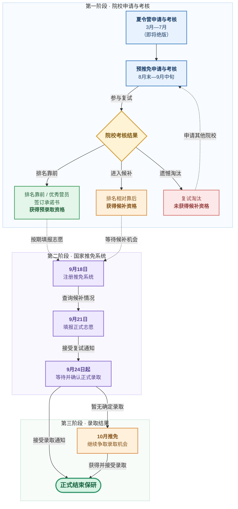
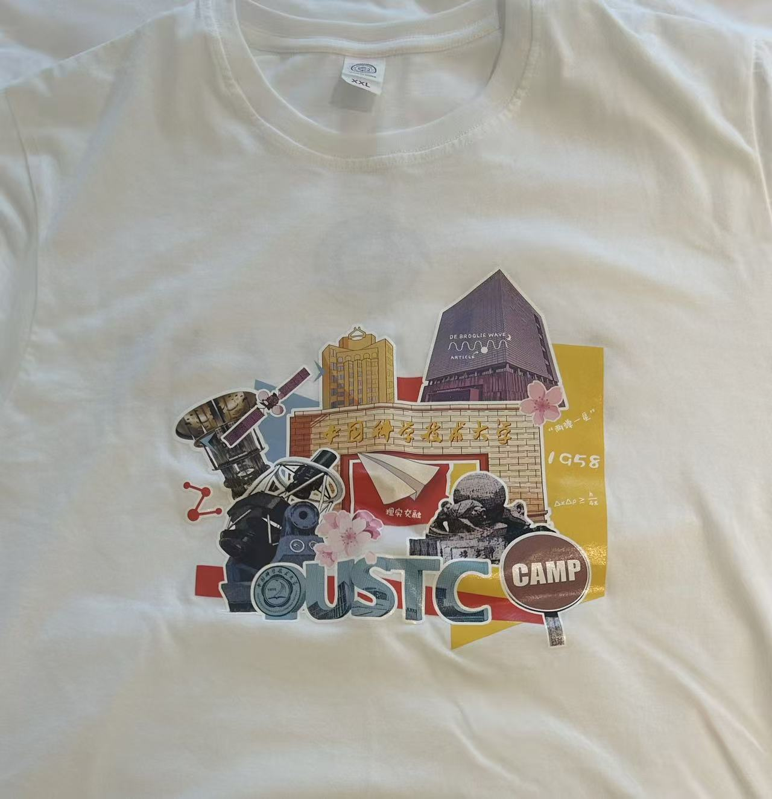
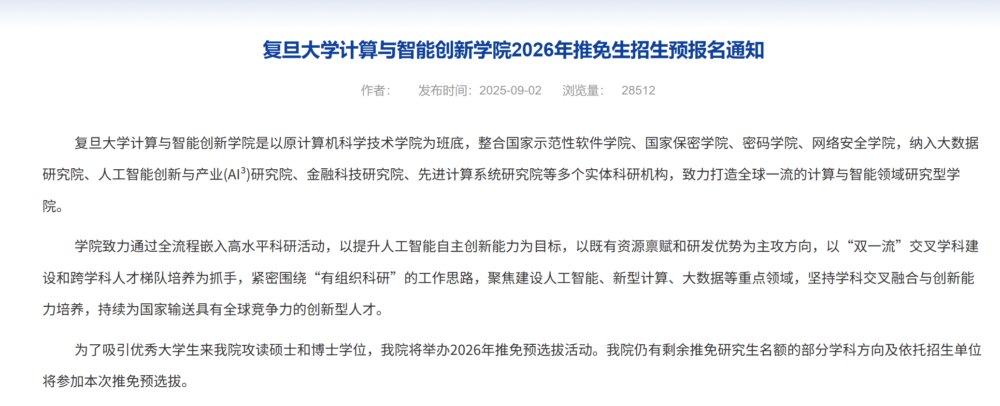
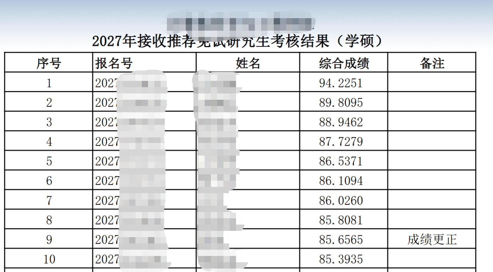
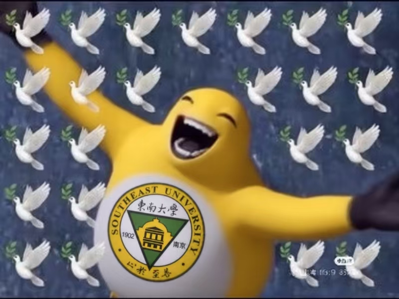
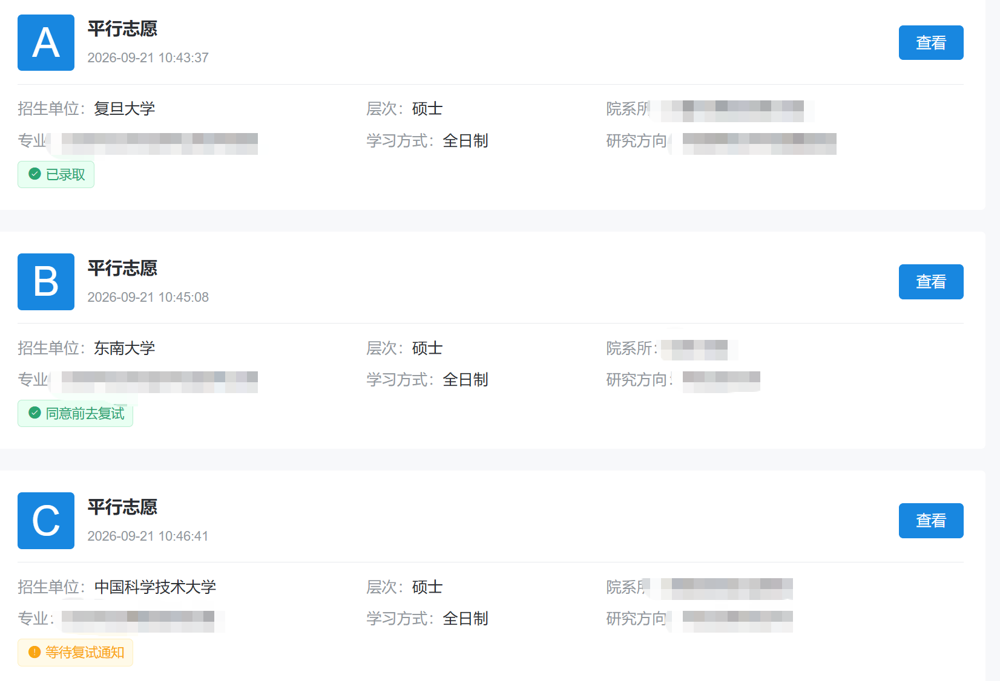
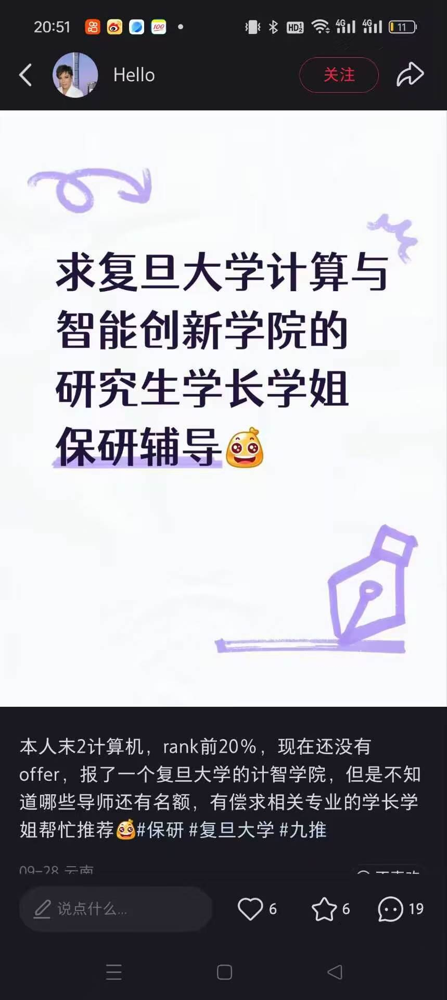

# 保研

> **内容性质：** 年级课程导读与个人经验
>
> **适用范围：** 暨南大学计算机科学与技术专业学生。
>
> **最后核验：** 2026-10-07
>
> **作者：** [sekirooox](https://github.com/sekirooox)

## 保研是什么
根据研招网的官方定义：
>保研是指本科生通过学校**推荐免试**直接攻读硕士研究生的制度。

说人话就是：
+ **保研只是攻读研究生的一种手段**，在地位上与考研等价。**最终结果都是获得了研究生学位**，因此实际效果基本等价于境外留学。
+ 其中的"推荐免试"指的是**免去初试**，也就是免去"全国硕士研究生统一招生考试"的筛选流程，**直接进入复试环节**。

## 选择保研的主观原因
笔者也是保研er，结识了不少保研的同学，自认为了解相当一部分同学选择保研这条道路的心态。

|出现频率 | 主观目标 | 心态详解
| --- | --- | --- |
|高|误打误撞来保研了| 大学学了几年，结果发现有机会保研。沉没成本太高，要不狠下来走保研吧？|
|中等|免去研究生入学考试 (初试)| 孩子想读研；考研太难了，不想考研😱；家里贫困潦倒，没钱留学😭。|
|低|了解保研的优势|认真调研过保研这条路，觉得保研能最大化实现人生价值|
|极低|三年换一年的GAP|孩子努力三年，想要个研究生入学资格，还想痛痛快快玩一年|

就我个人了解，大部分同学其实**一开始都没什么保研的计划**，到了大二甚至大三才幡然醒悟😂，觉得自己可以保研。

甚至，部分同学**就是纯粹的不想考研**，觉得学习考研的内容浪费时间，但迫于某种压力，需要一个研究生学位。

一开始就下定决心想要保研的同学，在我观察里十分罕见。

## 保研的流程

### 第一阶段：院校的申请与考核
一般来说，院校的申请有两种途径：夏令营和预推免。

#### 夏令营
定位一般是院校**参观**+考核的综合活动。

然而，随着保研政策的变化，**各大院校的夏令营有逐渐取消的趋势**，甚至出现了"参观营"，**即完全没有任何的录取效力**，以院校参观和游览为主。

> 就2026年的情况来说，只有清北，部分华5 (SJTU，USTC和ZJU)，两所京校 (UCAS部分科研所和RMU)开设了夏令营且有录取效力。

>注意：**绝大部分夏令营的交通费需要自理**，少部分院校会包食宿。
<figure><figcaption>
USTC夏令营发送的礼品：包含UTSC的纪念衫，USTC的书包和手提袋 (未展示)。令人感到的是，USTC还为参加营员赠送了为期3-4天的全季酒店住宿。
</figcaption></figure>

#### 预推免
预推免：这是绝大多数保研er的主要战场，**一般仅设有考核环节**。

正常来说，在推免系统开放的前几天，各大院校都会开展自己的复试。例如，图例是[复旦大学计算与智能创新学院2026年的预推免招生通知](https://cs.fudan.edu.cn/5f/a6/c24277a745382/page.htm)。

<figure><figcaption>
示例：复旦大学会在9月初开展自己的预推免招生工作，组织各校考生参加复试工作。
</figcaption></figure>

常见的考核设置有:
+ **笔试 (极少数学校)**。典型案例，NJU，RMU和JNU，~~JNU你怎么敢的呀~~，考察内容就是考研计算机基础408的内容，题量和难度应学校而异。部分学校例如RMU和NJU的笔试题目非常难，还包含最优化方法，离散数学 ~~(比JNU教的离散数学难上好几个档次)~~，人工智能方面的内容，据说满分100分，平均分只有10多分。
+ **机试 (部分学校)**。典型案例，ZJU，BHU和FDU，考察内容包含算法设计与分析，一般分为ACM赛制或OI赛制，**难度普遍对齐ICPC，CCPC等算法竞赛**，题目的梯度设置可以参考[CCF-CSP](https://www.cspro.org/)：总共五题，第一题是签到题，第二题是洛谷黄题水平，第三题及其以上则对应洛谷绿题及以上的水平😱。

>**你需要尽早准备机试**！机试高分的同学有很大可能总分领先，进而获得录取名额！
>
>**部分学校对机试低分的同学有斩杀**，即使面试再高分也无能为力！

+ **面试 (必有)**。免试主要考核的内容就是科研经历 (占比高)+专业课知识+英语 (占比低)。如果你的科研经历比较丰富，基本不会考察专业课知识；反之，**如果你的科研经历匮乏，极有可能会疯狂拷打你的专业课知识**，即使你答得比较好，也很可能低分！
>不要寄希望于专业课能回答上来！而是应该把自己的科研经历复习充分，确保能够做到对答如流，这才是面试的杀手锏。

在参加完复试过后，院校可能会**公示一个包含所有学生的考核成绩名单**，例如图例是2026年东南大学的考核成绩名单。

<figure><figcaption>
示例：东南大学在考核结束后，公布的名单。
</figcaption></figure>

值得注意的是，**有些学校可能不会告诉你是否具有录取资格**，但是排名靠前者一般都可以称得上稳录取，翻车的人数很少很少很少。

如果院校不公布，**报名系统**可能也会不定时公布你的考核结果，或者**通过邮箱**进行通知。

#### 院校考核结果

假如你**排名突出**，在院校的录取人数范围内，基本上你可以认为已经拥有了该校的录取资格。恭喜你，你可以到时候填报推免系统了🥰！

假如你**排名靠后**，甚至处于垫底水平😭，也无需过分担心，你即将品鉴保研过程中不得不品鉴的一环：

>**"这里怎么全都是鸽子🕊呀"**

<figure><figcaption>

</figcaption></figure>

值得注意的是，**绝大部分高校，都不会直接"斩杀"排名靠后的同学，而是作为它们的候补**，如果前面有同学放弃录取，那么院校一般会主动联系靠后的同学，**即使排名靠后，也完全有机会被录取**。

>焚决：祝福前面的大佬有更好的去处。

部分高校由于心高气傲，导致招生生源显著优于往年，甚至出现了往年生源都是211为主，今年有清北华5的同学来竞争的情况，**导致最后发放录取时，排名靠前的人全都不来的盛况🤣**，即使是排名倒数第一的同学，也能有学上的情况，**我们一般称之为"鸽穿了"**。

笔者整理了一些学校的鸽穿情况如下：
+ 2026 USTC CS学院几乎鸽穿了。
+ 2026 SJTU CS学院鸽穿了。
+ 2026 FDU CS学院鸽穿了，紧急扩散和补录。
+ ...

所以，人们常说"**入营就是胜利**!"，无论自身背景再差，排名再低，只要前面的人放弃，录取资格就会追着你来！

假设你**被复试淘汰了**😭，千万不要灰心，赶紧寻找下家吧!
> 和XXX有缘而无分

### 第二阶段：填报推免系统
#### 注册推免系统
一般到了9月18日，保研er就可以开始正式注册推免系统啦。这个时候你需要先填写自己的个人身份。JNU会为你提前注册好推免资格。

#### 填写推免志愿
而到了9月21日这天，你就可以开始填写你的推免志愿了。

每一个保研的同学在此期间可以**填写多个志愿**。至多不超过3个平行志愿，每一个志愿有48h冷静期，如果被拒绝或者时间到了，可以更改新的志愿。

<figure><figcaption>
推免系统志愿填写的页面
</figcaption></figure>

接下来9月22日，院校官方会给参加过夏令营或者预推免的同学发放复试通知。注意，这个复试通知不等于拟录取通知！院校官方只是遵循流程给你发放，**无论你是否有录取资格，只要你参与过考核，他们都会为你发放**。
> 官方层面上是先填写志愿再开展复试，最后决定是否录取你。
> 
> 但是实际执行层面上是先复试完，然后再让你填写志愿，最后录取你。

#### 发放拟录取通知
最后是9月24当天，院校会在8点以后陆陆续续为通过考核或者候补成功的同学发放通知。

在下午2点之前，你是看不到任何一所院校的拟录取通知。

有且仅有在下午2点之后，你才能看到并且接受拟录取通知！

>部分学校会在早上打电话与你确定意向，或者通知你候补成功，或者在QQ群里通知发送的拟录取情况。
>
>**候补的同学一定要确保联系方式通畅**！方便第一时间接受院校的电话！

### 第三阶段：接受录取通知或者10推再战
#### 正常接受录取
如果顺利的话，你在924的下午2点第一时间就可以确认录取。

如果你没有稳定的offer，你可能需要等待至晚上。不过一般不用担心，**只要不是太低位候补，都能成功上岸！详细鸽子🕊！**

>据我所知，绝大部分候补的同学都在发放录取当日 (2026年是9月24日，简称924)候补成功，极少数在924之后才候补成功。

#### 10月推免捡漏
即使没有在924当天上岸，少部分同学在10月的时候捡漏各大名校的补录。

>**注意：捡漏有风险**！

<figure><figcaption>
这位同学的rk20%大概率是保本校的，但是他却利用10月最后的推免机会，捡漏上了复旦大学的计算机学院，可见不到最后一刻不要放弃自己！
</figcaption></figure>

#### 推免系统关闭
到了11月，推免系统就会关闭，保研会正式结束！

## 保研vs考研vs留学
### 保研的优势
我个人认为保研相对于考研，留学来说，有以下几点的优势。

#### 容错率很高
与考研不同，保研的官方录取时间一般为**9月上旬至10月结束** (例如2026年为9月24日-10月27日)。

**你有三个可以修改的志愿，只要愿意，保研的同学总有研究生读**！

>相比只有一个志愿的考研，保研的容错率无疑是非常高的！
>
>~~何况，**JNU会收容每一个无家可归的孩子** (前提是你得参加他的预推免)。~~

#### 认可度更高？
其实这是一个**非常经典的伪命题**，以至于部分家长甚至同学自己都觉得保研就是"高人一等"，喜欢给自己的孩子/自己贴标签。

实际上，往届很多优秀的CST同学都主动放弃了保研资格，选择留学或者考研 (比较少)这条道路，**所以不要神话保研**。

#### 可以直接攻读博士学位
保研的同学在定位上是"科研型人才"，因此在申请的时候可以选择**直接攻读博士学位** (简称"直博")。

目前大多数高校的直博制度比较完善，如果顺利攻读，**最少需要5年时间**，远远少于硕士+博士的8年保底的时间。

你有机会**实现30岁之前拥有博士学位**，且即使中途因个人原因无力攻读，也可以申请转为硕士。

> **直博是一把双刃剑**。如果能顺利读下来，无疑是非常巨大的优势，但如果中途而废，则有可能落得个博士肄业，只有本科学历的悲惨结局！

#### 优先选择的权利
作为大陆传统的升学途径，保研更有机会到一个学校**科研实力/就业突出的课题组 (以下简称"强组")**攻读3年的研究生学位。

一方面，这些强组的名额是相当有限的，而且理论上保研和考研的名额是**共享的**，没有什么区分。

导师普遍主观上更喜欢能够提前进组学习，有一定科研基础的保研同学，会**把绝大部分招生名额留给保研的同学**，那么留给考研同学的机会就不多了🫥。

另一方面，保研的同学普遍大四上开学就完成了升学任务，而**大四上-研究生入学**这个时间段，完全可以用于**提前进入课题组**，熟悉课题开展科研工作。

亦或是可以用于**外出实习**，比考研的同学多出一段宝贵且自由的时间，一般称之为"GAP"。

如果你的职业规划清晰的话，你可以利用这段时间：
+ 提早完成老师的科研任务，达到毕业条件，**甚至实现研一就出去实习**。
+ 提前了解就业方向，**积累一段6个月左右的实习**经历，更有利于进入大厂。
+ 或者你**直接就想玩一年**。

#### 不想考试
对于一个经历过高考的人来说，**可能没有人想无端端经历第二次的高考 (考研)**。

客观来说，保研也确实是一种针对"不想考试" (准确来说是，不想经历大考)的人的一种新途径。

### 选择保研的劣势
> **保研很可能是陷阱**。

#### 三年新高三
每一次期末考试都是一场大战，从早上复习到深夜，持续一周甚至一个月的场景甚至屡见不鲜。

绩点和排名是保研er的底牌，**0.00x的绩点差距直接决定你的排名，甚至你的保研结果**。

#### 竞赛之苦
虽然外面的学校几乎不认可你的竞赛，但你不能没有，因为你肯定需要这些竞赛成果来为你校内推免加分。

**部分竞赛本质是"水赛"，却需要你耗时大量心血**。做这件事的过程也是令人作呕的，部分队友坐享其成，让合作本身变成了对你的成倍折磨😵。

#### 科研之苦
> 作为保研最重要的权重之一，有一篇一作论文自然是极大的加分项。

就计算机专业而言，现在已经内卷到"人均论文"的境界，本科学校越是不行的同学，越需要一堆顶会/顶刊论文来证明自己！

很遗憾，你选择了JNU，这个学校就是一所**中等的211** (暨专😭)，如果你想冲击比较好的985(例如SYSU，甚至是华东五校)，科研经历是必备的。

现在Codex大人已经极大程度简化了发论文的流程，也使得很多同学 (包括985的同学)，都有了一作论文，假设你没有论文，你谈何和更加优秀的学生竞争呢？

目前单靠绩点来评价一个人的方式，被很多学校所淡化了，**因此科研工作 (准确来说是已经发表的科研工作)，成为了重要的评估指标**。

> SEU的入营标准中，发表一篇A会一作论文，可以直接进入复试；发表一篇B会一作论文，可以加约10分综合分，权重甚至超过了排名第一带来的加分。

更加遗憾的是，**JNU的老师们很少培养自己学校的本科生**，甚至找不出几个愿意培养本科生的课题组，这会导致相当一部分的同学在课题组待了1-2年，却连偏论文都发不出去。

所以，如果你想本科期间在JNU发表一作论文，也许最好的方法是离开JNU，寻找校外科研机会。

> 想要离开JNU，最好的方法是直接离开。

> **学长完全支持你对JNU实行正义切割！**

#### 焦虑感
一方面,**很多同学在9月24日前都没有稳定的offer**，部分同学为此忙到焦头烂额。就2026年来说，我认识不少同学，甚至有SYSU前10%的同学，在924当天前，都没有一个可以稳定录取的名额 (包括本校)，**所以临近结果的这几天将会无比煎熬!**

另一方面，保研的过程中会结识很多优秀的学生，难免不了与他们进行对比，~~然后就会发现自己貌似一无是处，自卑感和同辈压力plus~~😵。

#### 上升渠道在收紧
>客观来讲，保研的难度在逐年攀升，尤其是计算机相关专业的保研。

从评价体系来说，排名的权重会逐渐下降了，如果你不是第一，那么你的排名可能也没那么重要了，**现在老师都特别关注你的科研经历**，如果你没有什么科研经历，很可能被别人嫌弃。

**能保研的人越来越多，好学校的接受名额却没什么变化**。随着逐年扩招，JNU的保研率每年都会有大幅度的增长，之前2023年还是5%左右，2026年已经到了12%左右了，几乎每年都递增50%，比JNU稍差的学校保研名额扩招幅度更加可怕，这就会导致一个现象：
>保研er的人数呈指数爆炸

然而，不幸的是，**绝大多数学校，例如SYSU和SCUT等，接受推免生的名额并无显著增大**，每年增长幅度甚至不超过10%。

原先2000个人争夺400个名额，现在是4000个人争夺500个名额，报录比疯狂增长，录取到名校的机会正在快速缩小！

为了解决保研人数爆炸的情况，**部分院校开始"卡本科"了**！就笔者于2026年的经历而言，有明显卡本倾向的学校有：

+ HIT：**211和双非最严厉的父亲**，985基本点送。
+ ZJU软件学院：今年据说**只有211 RK1能稳入**，其他RK需要一作论文。就双非而言，本地双非 RK1+论文+ACM牌子才能入。
+ NJU软件学院：以前非本地211可入，今年卡985和江苏本地211，其他省份211很难入，**斩杀双非**。
+ SYSU计算机相关学院：985 10%左右可入，211只要RK1/2，最好还要有科研经历，**双非严父**。
+ USTC某学院：985占比70%，**211占比29.5%，双非占比0.5%** (仅有一位)。

不难发现，以后卡本的情况会越来越严重，现在知名学校对于双非的容忍度很低很低，对于211的学校也卡的比较严厉，**且以后说不定会卡985**。

>所以以后降保和平保的现象会越来越严重，上升的渠道会越来越窄。

**所以如果想冲刺顶尖院校 (THU/PKU/HIT，华5)，保研很可能不如考研！**