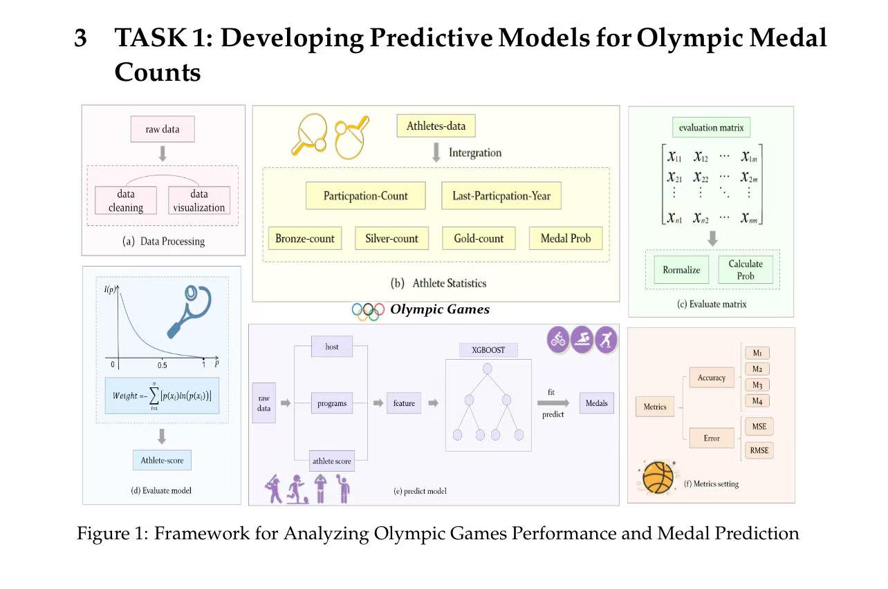
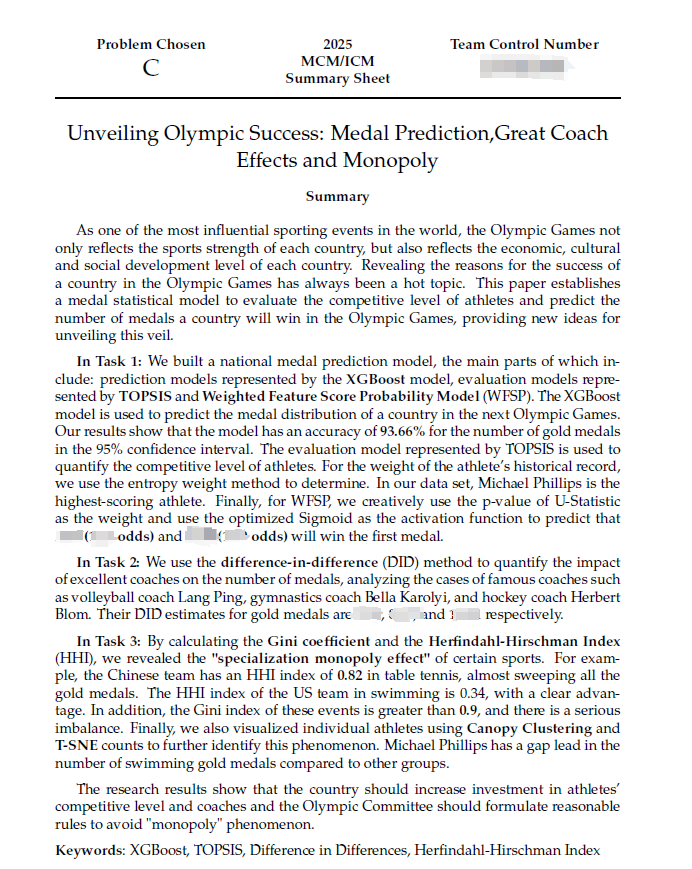

# 数学建模类竞赛的经验贴

> **内容性质：** 年级课程导读与个人经验
>
> **适用范围：** 暨南大学计算机科学与技术专业学生。
>
> **最后核验：** 2026-10-08
>
> **作者：** [MayL](https://github.com/sekirooox)

## 前言
~~数学建模类比赛在保研的时候几乎没人过问过我~~，不过鉴于他的获奖难度，我个人认为还是有必要写一篇文章，让大家都来水水这个比赛的来**进行综测和推免加分**。

## 数学建模的分工
老师常说理想的分工包含：建模手，编程手和论文手。

但说实话，这已经是远古时期的分工了，~~**现在有Codex大人了，编程手完全没必要存在了**~~。

~~**就论文手而言，我感觉大抵也是摸鱼的职位**~~。一方面，建模手的思路没办法100%迁移给论文手，容易出现理解偏差；另一方面，~~论文手远远脱离实际的编程和建模，也很难凭空根据思路和结果造出一篇高水平的参赛论文~~。

### 个人认为理想的分工
**三个"全能手"**，两个擅长"建模"，一个擅长"绘图和美化"。

全能手意为建模，编程和写作都有一定经验，**这种经验可以高度概括为科研经验**，以核心身份 (一作或者二作)参与一篇科研论文。

### 理想的人选
数学建模本质小型科研，以科研思维来开展数学建模有大帮助，最好选择一些**有科研经历，甚至有科研成果的人作为队友**。

## 如何建模
近年来，数学建模的知识点变化很大，且出题非常灵活，基本上**按照书籍的方式来啃知识点的做法已经完全不可取**。

目前主要借助AI来进行建模，当然AI也不是全知全能的，作为人，你的作用就是调研相关领域的论文，例如对于奥运会奖牌预测任务来说，**你就要优先去调研是否有相关的论文，然后自己或者让AI帮你想局限性，进而提出创新点**。

笔者就是在竞赛过程中，看到了一些相关的论文，最终将他们的思路融入到比赛过程中，取得了优秀的成绩。

>当然你的方法不能抄袭，但据我所知，**数学建模对你方法的创新点要求不高**，就是很好的应用+小幅度修改即可！

## 写作
数模的写作个人感觉和科研论文差不多，你可以找一篇相关领域的文献，仿照他的写作结构来进行开展。

最后，**你需要给出非常清晰的框架图**，用于描述你的写作思路和创新点。

你的写作最好能围绕这个框架图展开，不要让人觉得逻辑很奇怪！

### 框架图
<figure><figcaption>
我们队伍针对任务1的摘要，不需要太多花里胡哨，主打就是逻辑清晰。
</figcaption></figure>

>注意：尽量不要使用AI直接生成的图，反正我看到就会很反感。

### 摘要示例
第一段基本起到了"摘要中的摘要"的作用：
>讲解数模这个**任务的情景**，然后简要讲解你们**提出了一个什么框架，解决了什么任务**。

这段先不用讲解你们的创新点。

后面几段开始分任务描述你们的解法，最好能高亮你的创新点，**给出具体的数值**，不要泛泛而谈!

<figure><figcaption>
我们在25年美赛参赛论文的摘要
</figcaption></figure>

## 小结
感觉数模这个东西挺玄学的😂😂😂，很多优秀队伍的论文反而不会很讨好，因此笔者也没什么太好的建议🫤。

>冲就完事了！把竞赛的分多多刷满就行了。

## 参考资源
+ [MCM 2025 Finalist](https://github.com/sekirooox/MCM-2025)
+ [APMCM 2025 First Price](https://github.com/sekirooox/APMCM)

>注：这些资源都年久失修，想复现我估计有一定难度，而且**不一定完全适用于新时代的数学建模**。
>
>如果你对于参赛论文很感兴趣，建议你可以咨询我的github主页，里面有我的联系方式，进而**获得参赛论文**。