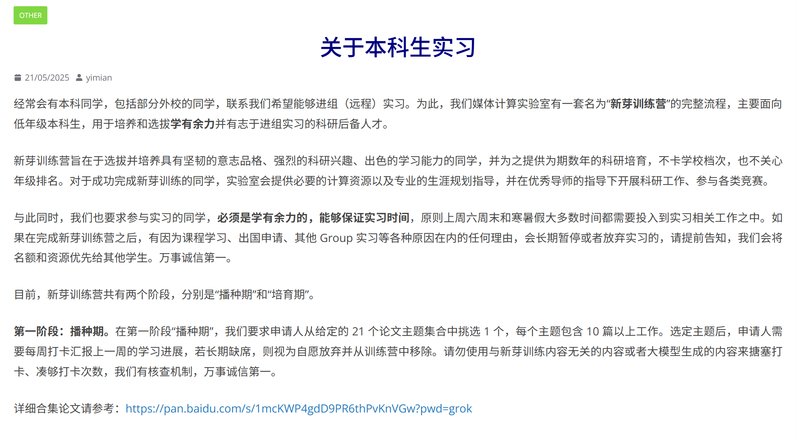
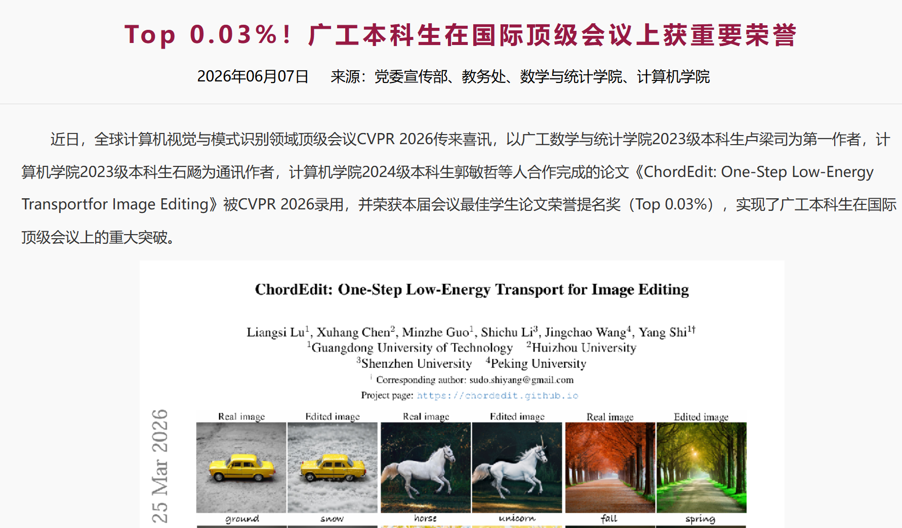

# 如何选择合适的导师？

> **内容性质：** 年级课程导读与个人经验
>
> **适用范围：** 暨南大学计算机科学与技术专业学生。
>
> **最后核验：** 2026-10-08
>
> **作者：** [MayL](https://github.com/sekirooox)

## 前言
>科研是本科期间最能拉开与其他同学差距的手段。

本贴**主要为大家提供一些信息和选择建议**。

## 候选项
### 校内强组或者青年老师🤔
青年教师，例如K Cao，R.H Wu等，由于有升副教授/正教授的压力，往往会拼命的push自己，在这种情况下，你作为本科生，与他目标一致，出成果的可能性更大。

>不过这个不绝对，部分老师是因为发现在JNU容易躺平才来的这个学校。

---

校内强组，比较典型的就是JNU[智慧教育研究院](https://ise.jnu.edu.cn/main.htm)的大导，例如Z.T Liu，K Wang等，他们的课题组**有着JNU来说相对充裕的计算资源**，支持他们课题组一直发高水平的论文。

>注：~~JNU**绝大多数导师课题组的计算资源 (GPU)很差**，远远落后于时代~~。
>
>没有计算资源的话，很难从事较为前沿的研究方向。而且，小众课题，实际上也很难出成果。

不过选择这些大导的话，有一定的风险。他们的课题组体制较为成熟，**老师可能已经远离科研第一线很久了**，根本没空指导你，因此**极大可能是博士生来带你**。

而博士生本来就有其他方面的压力，只能说和你有共同需求 (发论文)，因此你需要竭力讨好 (舔)师兄。

>师兄强则你强。
---

此外，**你还可以选择网安院的老师**，这些老师一般也会接受自己学校的本科生。

JNU的网安实力还是可以的，不过你也得应用上述的筛选过程。
>而且部分网安的课题比较晦涩难懂。

### 能否去校外找导师😋
这是一个很好的问题。事实上，据我观察，本科期间有顶会/顶刊一作/二作的同学，不少都是借助的校外的课题组资源 (**JBJI学院很多这样的例子**)。

这种做法的好处是，不需要再依附于实力孱弱的JNU，直接借助校外的课题组资源开展相对前沿的研究。

另一方面，部分导师对于论文的需求是很大的，组里很缺人，基本没有其他的杂事，甚至可以all in 科研，这与你的目标完全对齐，你不用担心缺少指导。

>离开JNU最好的方式就是直接离开这里。

这种做法的局限性是在，外校的老师可能会**拿你当作免费劳动力**，简称打黑工。

而且，他们培养你的优先级不高，除非你以后愿意推免到他门下，而且你没办法证明你的稳定性 (部分外校老师**不接受远程实习**)。

此外，校外课题组**一般都有接受门槛**，一般都要求你有一定的**科研经历**，甚至**有考核流程**。

典型代表有[NKU的CMM课题组](https://mmcheng.net/undergraduate/)：需要两个阶段的实习，可能需要耗费你3-4个月的时间，且考核成功后才能进入课题组学习。

<figure><figcaption>
NKU CMM课题组的本科生科研实习要求
</figcaption></figure>

~~不过人家课题组是真能出成果😭，很多人抢着去~~。

---

与之类似的是RA岗位，即**研究助理**。主要职责是参与某个课题组的课题研究，与校外科研的区别就是**一般有少量工资（200元上下/天）**。

这种大多数需要**线下**，好处则是容易证明自己的稳定性，得到老师的器重，**相比远程科研实习，更有机会产出论文**。

### 选择往届读博的学长🥰
如果你人脉比较好的话，可以选择到外校读博的学长学姐。

这种情况也是很常见的，**学长学姐自然也会愿意提拔一下学弟学妹们**。

最为典型的案例是GDUT的同学们在2026年完成的CVPR Best Student Paper。

<figure><figcaption>

</figcaption></figure>

其中第一和通讯作者都是**在读博/有读博想法**的学长，和学弟学妹之间自然会有一些经验上的传承，**与前几种方法对比，出成果的机会是最大的！**。

### 简评导师制🫥
CST的导师制是一个**零成本的科研训练**机会，但也就意味着他们手底下的本科生往往非常多，而且大多数都是滥竽充数，没有实质贡献。

导师**很有可能会忽视有论文需求的同学**，说人话就是**放养**本科学生。

很多同学觉得自己加入导师制就行了，导师或者研究生学长就会主动让自己参与项目，但**实际上这些都是要自己主动争取的**。

>千万不要觉得在课题组里面就行了，然而假努力了几年还不自知！

