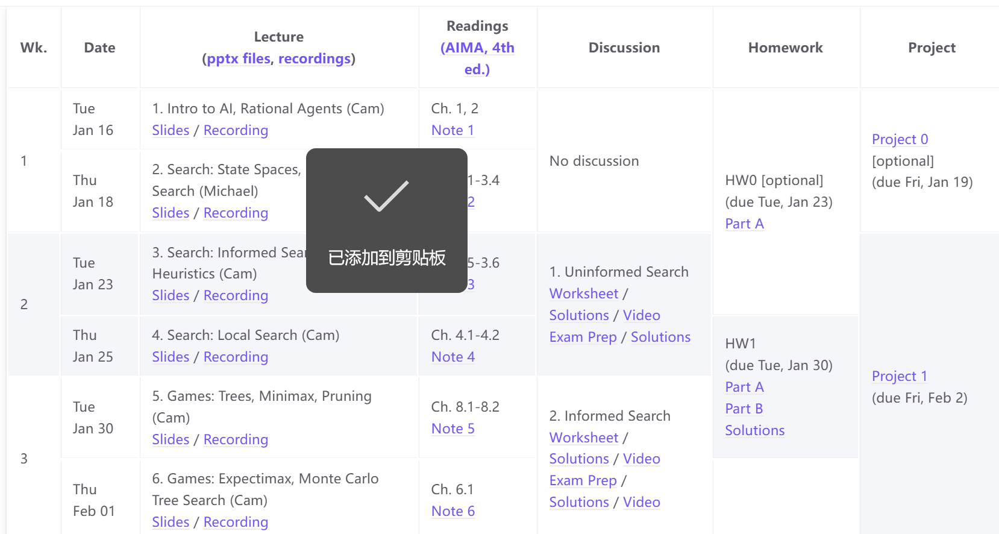
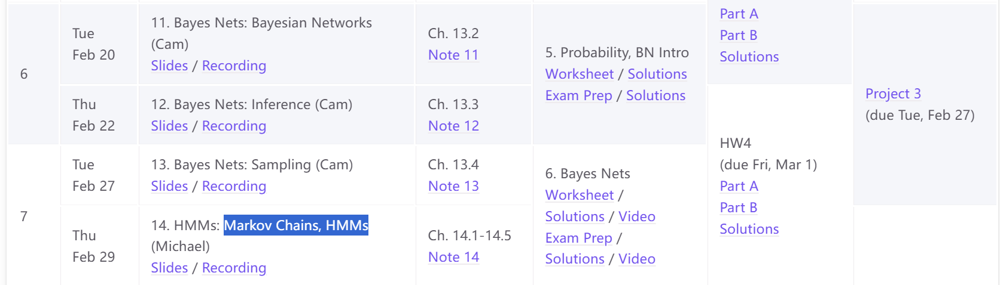
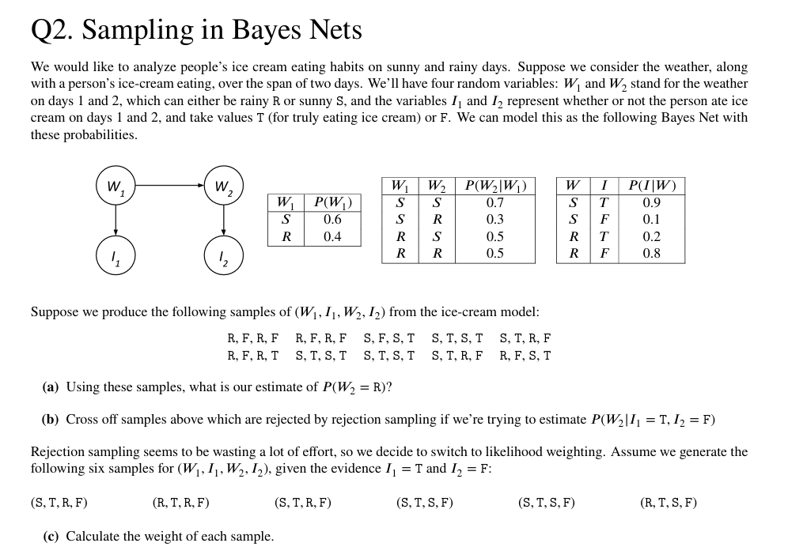

# MayL 对 Z.H Jiang 讲授人工智能（全英）的评价
<!-- (必选) 给出课程的主要信息 -->
## 课程记录

| 项目 | 内容 |
| --- | --- |
| 授课教师 | Z.H Jiang |
| 修读学期 | 2024-2025 |
| 考勤方式 | 有签到；有课堂任务 |
| 每周作业 | 不定时 |
| 期中测评 | 有 |
| 结课方式 | 期末考试 |

<!-- (可选) 进行评分，增强文章美感 -->
## 个人评分

| 评价指标 | 评分 |
| --- | --- |
| 综合评分 | ⭐⭐⭐⭐☆ **3.5 / 5.0** |
| 课程难度 | ⭐⭐⭐☆☆ **3.0 / 5.0** |
| 授课水平 | ⭐⭐⭐☆☆ **3.0 / 5.0** |
| 给分体验 | ⭐⭐⭐☆☆  **3.0 / 5.0** |
| 个人收获 | ⭐⭐⭐⭐☆ **4.0 / 5.0** |

## 个人评价

### 一句话评价
Z.H Jiang授课水平一般；这么课适合入门AI，对于数学要求不高，可以提前选修。

### 前情提示
我以为原先的"机器学习"课程被"人工智能"所取代了，结果一上课，**没想到讲解的是[CS188](https://csdiy.wiki/%E4%BA%BA%E5%B7%A5%E6%99%BA%E8%83%BD/CS188/#_1)的内容**🤣。

### 授课老师
Z.H Jiang老熟人了，因此不必多言😊。

### 课程内容
这门课主要讲解和考察了以下概念：
+ **AI的定义**：给出了强化学习 (RL)下**Agent的正式定义**。
+ **搜索问题**：Informed Search，DFS，BFS，A*，Min-max game等。
+ **贝叶斯网络**：Bayesian Networks。
+ **马尔科夫链问题**：Markov Chains, HMMs等。

<figure><figcaption>
AI Agent&Search Problem
</figcaption></figure>

<figure><figcaption>
Bayes&MDP&HMMs
</figcaption></figure>

### 考勤情况
不定期签到，占据平时分。

### 家庭作业
不定期布置，我印象中有两次家庭作业。

### 期中测验
总共**有两次期中测验**。题量不大。

测验题目来源于**CS188历年课程的家庭作业/期中考试/期末考试**。
由于CS188这门课程有过多个历史版本，例如2018 Spring，2025 Fall等，因此我实在没能力推断Jiang老师挑选的版本😵。

值得注意的是，Jiang老师会控制难度，基本上挑选的**题目都是中档题**，~~不然和算法一样人人都要捞了/(ㄒoㄒ)/~~

### 期末考试
难度适中，题量偏大。存在3-4道这种大题，一个问题连着多个小问，~~怎么这么多题，做不完了咋办~~。

<figure><figcaption>
期末考试的试卷大概有3-4道这种大题
</figcaption></figure>

Jiang老师的给分还可以，在选修课上属于中等偏上水平，本人最终取得了95分的成绩，学得比较好的同学有98分的成绩。

### 学习建议
+ Jiang老师会提供习题PPT，**里面有期末考试的原题或者扩展版本，请务必掌握**❗❗❗
+ 使用课余时间适当适应CS188的出题风格。

## 贡献信息

- 贡献者：[MayL](https://github.com/sekirooox)
- 贡献日期：2026-10-06

> **免责声明：个人评价属于主观性内容，本手册不为其内容负责。**
