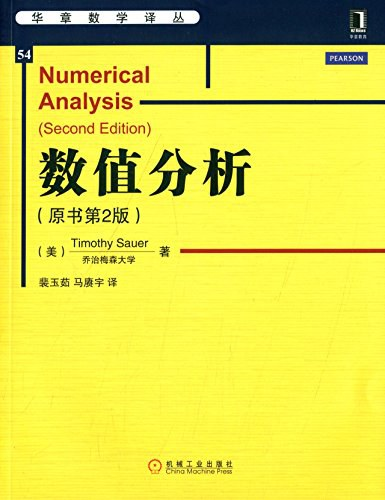
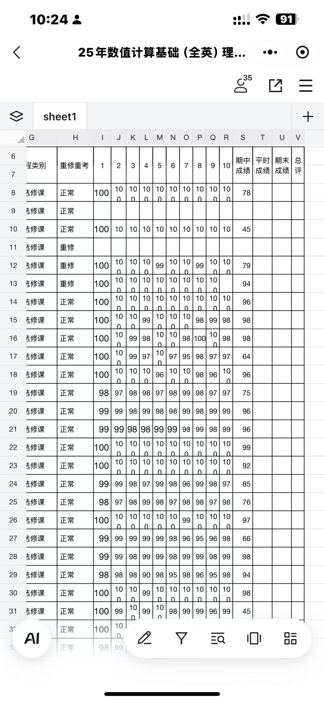

# MayL 对 L.D Fang 讲授《数值计算基础》的评价
<!-- (必选) 给出课程的主要信息 -->
## 课程记录

| 项目 | 内容 |
| --- | --- |
| 授课教师 | L.D Fang |
| 修读学期 | 2025-2026 |
| 考勤方式 | 签到，课堂作业 |
| 每周作业 | 有作业，需要提交 |
| 期中测评 | 有 |
| 结课方式 | 期末考试 |

<!-- (可选) 进行评分，增强文章美感 -->
## 个人评分

| 评价指标 | 星级 | 评分 |
| --- | --- | --- |
| 综合评分 | ⭐⭐⭐ | **4.0 / 5.0** |
| 课程难度 | ⭐⭐⭐⭐ | **4.0 / 5.0** |
| 授课水平 | ⭐⭐ | **2.0 / 5.0** |
| 给分体验 | ⭐⭐⭐⭐ | **4.0 / 5.0** |
| 个人收获 | ⭐⭐⭐ | **3.0 / 5.0** |

## 个人评价

### 一句话评价
L.D Fang的英语授课水平较差；不过PPT和考试内容比较对得上，全文背诵可高分。

### 前情提示
数值计算这门课，对于未来搞科学计算，AI Infra的同学也许有用🫤，不过**我对这门课讲授的深度存疑**，感觉重要的内容什么都没学到。

### 授课老师
L.D Fang本身也是科研向的老师，不过他比H.R Wu老师稍微好点，对于**这门课的PPT是比较上心的**，基本上光看PPT就能理解大部分内容。

回到课程讲述部分来，**Fang老师的英语水平挺差的**，有的时候需要逐字逐句的思考🤣，上课基本上就是一件非常痛苦的事情。

### 参考课本
+ 参考教材：这本华章数学翻译的"数值分析"。
+ 涉及的章节只包括：数值微分/积分，插值，特征值，最小二乘法和方程组的迭代求解。
<figure><figcaption>
数值分析
</figcaption></figure>

### 课程内容
**基本不需要听他讲课**。Fang老师的英语水平实在不堪忍受，而且他在黑板上的证明过程也比较模糊。

建议配合LLM搞懂PPT每一个证明细节就行。

### 学习资源
不适用。

### 考勤情况
不定时签到。

### 家庭作业
每周都存在家庭作业。

不过好笑的是，竟然是**自行批改**，而且**临近考试才上交检查**。绝大部分同学考前才开始做作业。

<figure><figcaption>
家庭作业人均100的含金量😄
</figcaption></figure>

不过需要注意的是，**作业内容与考试内容有一定相关**。

### 期中测验
只有**一次期中测验**，计入总分。

期中测验的考试题目**每年会有些变化**，基本可以参考：
+ [Quiz1](https://github.com/H3Art-q/JNU-IS-CST-Courses/blob/main/Numerical%20Computation%20%E6%95%B0%E5%80%BC%E8%AE%A1%E7%AE%97%E5%9F%BA%E7%A1%80/Misc/Test/%E7%AC%AC%E4%B8%80%E6%AC%A1%E6%B5%8B%E9%AA%8C%E7%AD%94%E6%A1%88.pdf)
+ [Quiz2](https://github.com/H3Art-q/JNU-IS-CST-Courses/blob/main/Numerical%20Computation%20%E6%95%B0%E5%80%BC%E8%AE%A1%E7%AE%97%E5%9F%BA%E7%A1%80/Misc/Test/%E7%AC%AC%E4%BA%8C%E6%AC%A1%E6%B5%8B%E9%AA%8C%E7%AD%94%E6%A1%88.pdf)

### 期末项目
期末考察以证明为主，主要包括课本上几个上篇大论的证明。

考试题目**基本源自PPT，家庭作业习题和期中考试**。

个人考试过程中**未看到新出现的题型**，最后考试分数为98，完美撤离🥰。

## 贡献信息

- 贡献者：[MayL](https://github.com/sekirooox)
- 贡献日期：2026-10-06

> **免责声明：个人评价属于主观性内容，本手册不为其内容负责。**
