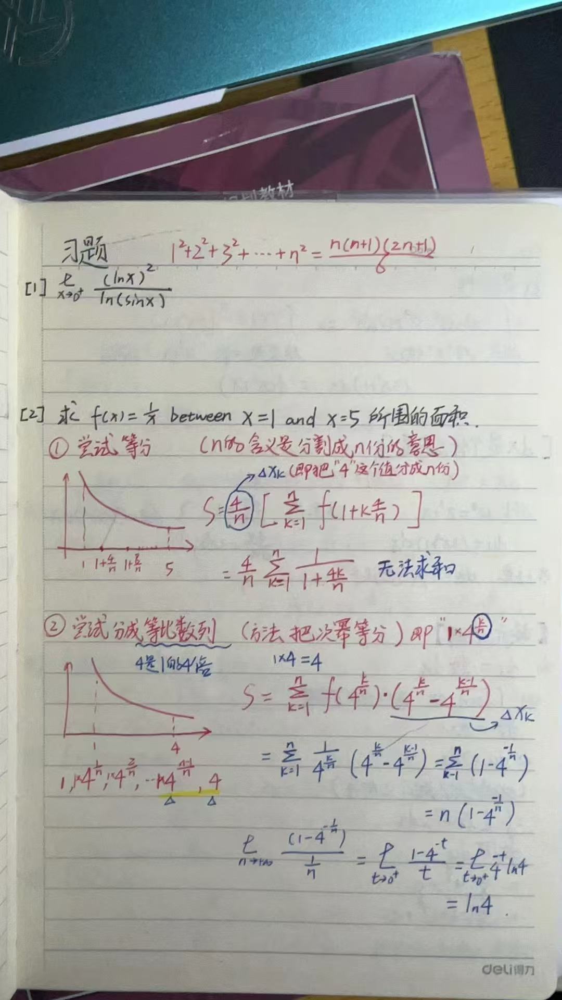

# MayL 对 L.Q Wu 讲授《微积分Ⅰ》的评价
<!-- (必选) 给出课程的主要信息 -->
## 课程记录

| 项目 | 内容 |
| --- | --- |
| 授课教师 | L.Q Wu |
| 修读学期 | 2023-2024 |
| 考勤方式 | 无签到；课堂任务 |
| 每周作业 | 无 |
| 期中测评 | 无 |
| 结课方式 | 期末考试 |

<!-- (可选) 进行评分，增强文章美感 -->
## 个人评分

| 评价指标 | 评分 |
| --- | --- |
| 综合评分 | ⭐⭐⭐⭐☆ **4.0 / 5.0** |
| 课程难度 | ⭐⭐⭐⭐☆ **4.0 / 5.0** |
| 授课水平 | ⭐⭐⭐⭐⭐ **5.0 / 5.0** |
| 给分体验 | ⭐⭐☆☆☆ **2.0 / 5.0** |
| 个人收获 | ⭐⭐⭐⭐☆ **4.0 / 5.0** |

## 个人评价

### 一句话评价
L.Q Wu授课水平高，基本能理解；给分严格，普遍较低。
### 前情提示
按道理来说，CST的学生应该不用修读《微积分Ⅰ》，不过鉴于目前讲授高等数学(信息类)Ⅰ和Ⅱ的老师已经变更为Wu老师，我觉得还是有必要讲解一下Wu老师的授课习惯。
### 授课老师
Wu老师的授课水平比较高，基本能将比较抽象的数学概念解释的比较清楚。

然而，Wu老师属于比较**高冷那种 (北大数学系本科的含金量🤣)**，因此他对于学生的要求比较严格，不会特别耐心和慈祥地解答你某个问题。

此外，Wu老师还是那种**有点mean的人**。如果你上课迟到被他发现，**极大概率会被严厉批评，并且登记在黑板上当众表扬**。

### 课程内容
**他每次都是三节课只讲两节，最后一节用于给你当场写作业**。

授课内容基本围绕课程《微积分Ⅰ》的主题，内容涵盖**一元函数的微分，积分和微分方程及其应用**。

一般来说，他不会讲授微分方程的内容，但**存在以往的考试题中，出现了有关微分方程的应用题**，题目属于是比较晦涩难懂，加之如果你没学过微分方程，很可能完全留白。

我们2023届的考核重点有：
+ 导数的定义：要求你使用定义来求解某个**特殊函数的导数**。
+ 积分的定义：**黎曼求和的应用😭**。非常考察你对知识的理解和掌握，而且据我所知，你刷题是刷不出来这种题目的。
+ 定积分的应用：例如让你用积分求解面积的**实际问题**。
+ 微分方程：**这个一般不考，不过最好了解一下**，实际问题中可能会遇到。

<figure><figcaption>
2023届的大题
</figcaption></figure>

### 考勤情况
从不考勤，连续18周不来都没关系。

### 家庭作业
关于作业，他布置的作业内容基本取自课本的课后练习题，且一般只取偶数题，因为没有答案可以参考。

他布置的作业**你只能在课堂结束后马上提交给他**，否则不计分。

不过你也不用担心作业欠交太多，因为Wu老师明确提到，**如果你欠交太多/从不交作业，那么课程的平时分直接等于期末的卷面分**😁。

### 期中测验
Wu老师几乎从没有布置过期中测验。**如果某一天突然有了期中测验，则只能说明一种情况：他想翘课了**😂。

例如国庆前，他比你还想提前下班，他就会给你们安排变态小测验。小测验的难度和工作量是比较大的，基本上很少有人能做完并且按时提交，不过不用担心，Wu老师倒是对这个测验不太关心，**基本只作为平时作业/考勤的一部分，对最后的总分影响很小**。

### 期末考试
很遗憾，Wu老师从来也不可能给出任何的复习提纲，也不会给出任何的考察范围和可供参考的训练题目。

最难受的是，**最终的期末考核内容很可能与实际讲授内容无关。**

例如，隔壁FNC的同学上Wu老师的概率论时，Wu老师一再强调要注重定理的证明环节，并且强调要重点考察，但实际考试只有一道非常简单的证明题。所以可见，**你想从他嘴中挖出什么有利的信息，几乎是不可能的！**

最后，**你的分数比较低的话，例如40-50这个区间，他很可能不会捞你**。他的课程常年挂科率有30%，但据我所知，CST的同学由于对这门课程还算比较重视，因此挂科率不高。不过，**你想要从他手中拿98+的高分，这也基本是不可能的**。

## 贡献信息

- 贡献者：[MayL](https://github.com/sekirooox)
- 贡献日期：2026-10-06

> **免责声明：个人评价属于主观性内容，本手册不为其内容负责。**
