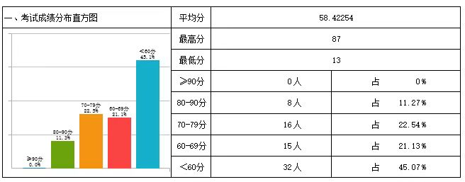

# MayL 对 S Long讲授《计算机导论（全英）》的评价
<!-- (必选) 给出课程的主要信息 -->
## 课程记录

| 项目 | 内容 |
| --- | --- |
| 授课教师 | S Long |
| 修读学期 | 2025-2026 |
| 考勤方式 | 无签到；无课堂任务 |
| 每周作业 | 无 |
| 期中测评 | 无 |
| 结课方式 | 期末考试 |

<!-- (可选) 进行评分，增强文章美感 -->
## 个人评分

| 评价指标 | 星级 | 评分 |
| --- | --- | --- |
| 综合评分 | ⭐⭐ | **2.0 / 5.0** |
| 课程难度 | ⭐⭐⭐ | **3.0 / 5.0** |
| 授课水平 | ⭐⭐⭐ | **3.0 / 5.0** |
| 给分体验 | ⭐ | **1.0 / 5.0** |
| 个人收获 | ⭐⭐ | **2.0 / 5.0** |

## 个人评价

### 一句话评价
S Long授课水平一般，给分非常低，个人收获少。

### 前情提示
《计算机导论（全英）》主要面向大一的CST新生，主要就是将计算机世界的各个方面，例如编程语言，编译原理，计算机网络和系统等进行概述。还有就是作为第一门专业课，让CST学生提前体验一下英文环境。

### 授课老师
Long老师的授课水平比较一般，基本就是照读PPT，然后突然即兴发挥，开始讲解自己的人生经历🤣。

课堂是比较活跃的，但是学习不到什么有用的东西。一方面是讲的太泛，没有任何具体的案例；另一方面就是Long老师会耗费相当时间来进行吹水，所以会显得内容冗长。

### 课程内容
**强度比较大，基本三节课全部拉满**。

虽然课程容量比较大，但是实际的干货非常有限。加上并没有任何课堂作业，课堂训练等要素，因此个人收获会很有限。

### 考勤情况
从不考勤，连续18周不来都没关系。

### 家庭作业
没有布置过家庭作业。

### 期中测验
没有布置过期中测验。

### 期末考试
Long老师的**期末考试是开卷的**，这么看貌似是个好消息，然而，**这恰恰就是他给大一新生设下的陷阱了**。

在以后的课程学习中，**你们会了解到，开卷有时并不是一件好事😒**。
+ **一方面，数学类的课程开卷没有任何用处**。最多就是忘记了某个定理即可来查阅一下，如果你对该定理没有任何练习，极大可能也不清楚其使用技巧。
+ **一方面，开卷的考试难度更高**。老师的出题资料和你已有的课本并不对应，这意味着你会在考试时浪费很多时间去寻找一个也许根本不存在的答案。老师也可以借助开卷之名，提高试卷的整体难度，进而拉高分差🤦‍♂️。
+ **最后，开卷会让很多学生失去警惕**。据我观察，很多大一新生觉得开卷考试就会放弃复习，以为考试时再查就行，结果到了考场后每一题都要查阅，不仅查不到有效的知识点，反而因为完全没有复习，导致寸步难行，最后挂科。

### 学习建议
据Long老师所说，本次考试的最高分勉强接近90分，**大约50%同学挂科，平均分约为60-70分**。

显然这不是一个良好的成绩，因此我建议大一的新生要重视起来😯！

<figure><figcaption>
@S Long老师的战绩。据我所知，这个平均分在CST是垫底中的垫底水平。
</figcaption></figure>

## 贡献信息

- 贡献者：[MayL](https://github.com/sekirooox)
- 贡献日期：2026-10-06

> **免责声明：个人评价属于主观性内容，本手册不为其内容负责。**
