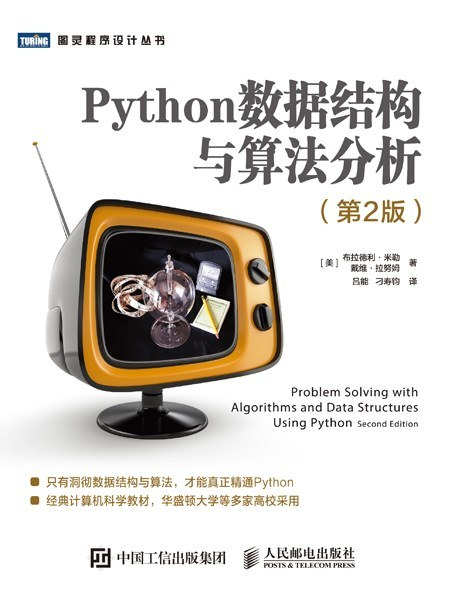
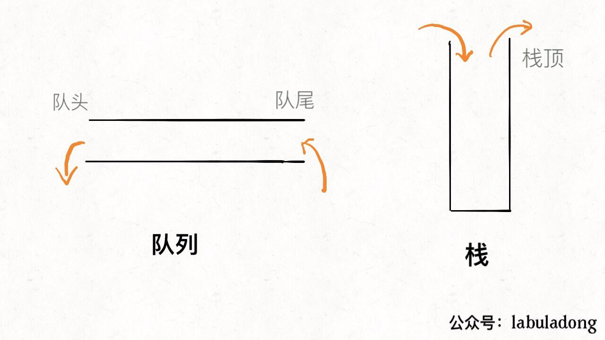

# MayL 对 K Wang《数据结构（全英）》的评价
<!-- (必选) 给出课程的主要信息 -->
## 课程记录

| 项目 | 内容 |
| --- | --- |
| 授课教师 | K Wang |
| 修读学期 | 2024-2025 |
| 考勤方式 | 有签到；无课堂任务 |
| 每周作业 | 无 |
| 期中测评 | 无 |
| 结课方式 | 期末考试 |

<!-- (可选) 进行评分，增强文章美感 -->
## 个人评分

| 评价指标 | 星级 | 评分 |
| --- | --- | --- |
| 综合评分 | ⭐⭐⭐ | **3.0 / 5.0** |
| 课程难度 | ⭐⭐ | **2.0 / 5.0** |
| 授课水平 | ⭐⭐ | **2.0 / 5.0** |
| 给分体验 | ⭐⭐⭐ | **3.0 / 5.0** |
| 个人收获 | ⭐⭐⭐ | **3.0 / 5.0** |

## 个人评价

### 一句话评价
K Wang应付教学的无奈之举，课程深度欠缺，个人收获少。

### 前情提示
说实话，数据结构DS作为408中核心的核心，我本以为果园这边会对其额外的重视，但遗憾的是，接手这门课的**Wang老师自从荣升正教授后，几乎不再教学了🫥**。因此不太能指望这门课的质量，建议自学。

### 授课老师
K Wang作为正教授，每天忙着自己的项目和开会，自然是把这门课的优先级调得很低，**因此上课完全是对着PPT念。甚至上课和下课时还会经常性的迟到或者早退😨**。

### 参考课本
主要参考这本：Python数据结构与算法分析。PPT和测验习题都是出自这本书。

<figure><figcaption>
Python数据结构与算法分析
</figcaption></figure>

### 课程内容
按照PPT的大纲来讲解，主要内容包括**单/双链表，树，排序和贪心算法的部分，基本上忽略了图论**。课本主要以Python为主，导致和考研408的题目存在明显的内容和难度的脱节。建议课后参照408的教材来进行学习和理解。

### 考勤情况
偶尔随机点名签到，占据平时分。

### 家庭作业
无家庭作业。

### 期中测验
无期中测验。

### 期末考试
整体难度中等偏低，我估计老师有课本对应的题库，**总体来看与课后题的重合度不高，与408真题都没太大关系**。

大题就是**设计题为主，例如栈和队列的转换**之类，较少出现408的原题。
<figure><figcaption>
设计题示例：要求你给出用栈实现队列的伪代码，语言不限
</figcaption></figure>

### 实验课
我们当年的实验课是**TA布置几道算法题**，难度从简单到困难不等。例如：
+ 简单题：三数之和。
+ 中档题：DFS/BFS相关的搜索题。
+ 困难题：线段树等"高级数据结构"。

### 学习资源
+ [leetcode](https://leetcode.cn/)：以后面试大概率会问，而且实验课主要以hot100为主。
+ [洛谷](https://www.luogu.com.cn/problem/list)：面向算法竞赛，例如OI/ACM，以后考研复试/保研复试有作用。

## 贡献信息

- 贡献者：[MayL](https://github.com/sekirooox)
- 贡献日期：2026-10-06

> **免责声明：个人评价属于主观性内容，本手册不为其内容负责。**
